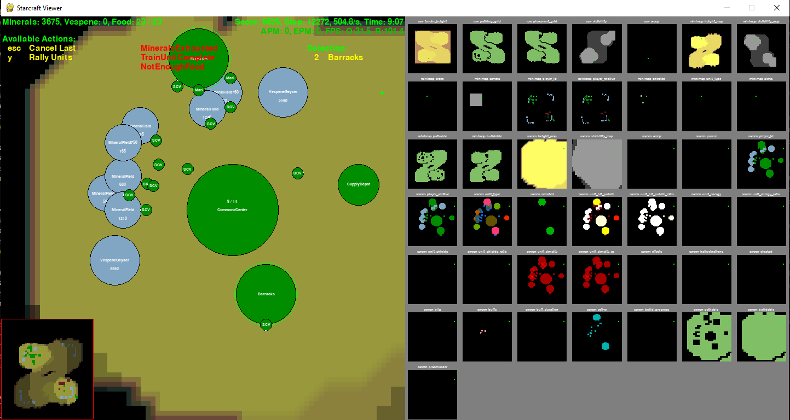
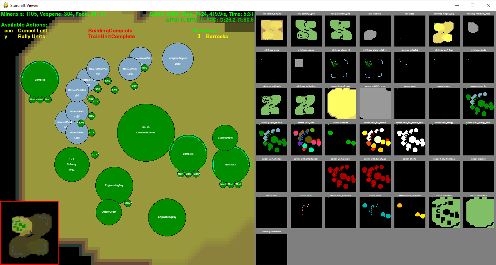

# SC2Agent

*This is a hand-in project on the Agent topic made by Fernando Vargas Álvarez.*

On this folder you will find the agent file (*terranAgent.py*), which if run correctly (with the proper [pySC2](https://github.com/deepmind/pysc2) library and with the game Starcraft 2 installed [*with the pySC2 maps in the game's installation folder*]) will run an agent that plays such game in the selected map. 

The agent will use the race Terran for playing and it's strategy at the beggining of this project is the following:

- Gathering minerals to be able to make two Barracks (*Marine* (soldier) *spawner*)
- Wait until it has created 10 marines and goes to attack the enemy. (This is a process that is repeated as many times as needed to either win or lose the game.)

#### Simple Agent rundown image:

These steps are good for defeating a very easy mode bot, but upping that difficulty the agent's loss time was getting smaller and smaller. So I decided to add some new features to the agent including:

- Making more barracks so more marines are being created (create 3 barracks)

- Creating a refinery so the Terrans can gather vespene gas.

- With the Barracks train (spawn) 15 marines so there can be a bigger offensive army.

- Create a Engineering Bay so updates can be made on the go. *However*, in it´s current state the agent tells a SCV (who are incharge of making the upgrades) to go to any of these buildings but, when it´s there the SCV does nothing and just waits on the Engineering Bay.

#### Terran Agent rundown image:

Get the full view of the agent's logic functioning on the [Agent Diagram](img/Diagram.pdf)

### References:

[Deepmind's StarCraft 2 Python Agent](https://github.com/deepmind/pysc2)