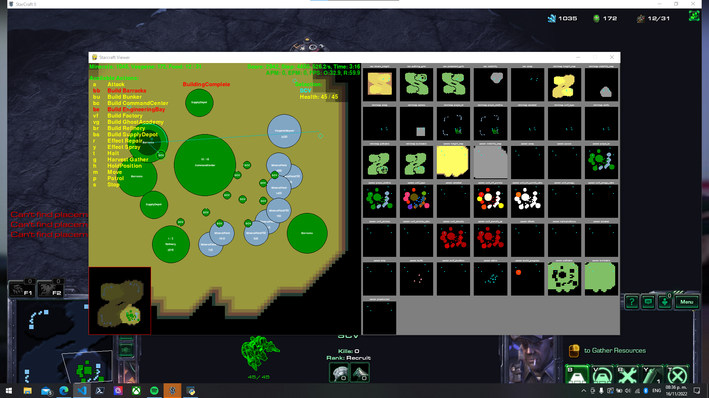

# SCII: Agents clash

Second Hand-in: Use the library pySC2 to make two agents battle each other. Currently I've built two agents, a [terran agent](terran.md) (which was Hand-in I) and a [protoss agent](protoss.md) (part of Hand-in II). 
### How to use it:

Use the following command to see the two agents mentioned above battle:
    
    python terranVsProtoss.py

### Differences between species and equivalents

There are many differences and different ways to play according to which race do you chose. I haven't played the game, *but* reading some wikis and watching gameplays I got this table of equivalences:
 

<table>
    <thead>
        <td>
            <strong>Role</strong>
        </td>
        <td>
            <strong>Protoss</strong>
        </td>
        <td>
            <strong>Terran</strong>
        </td>
        <td>
            <strong>Zerg</strong>
        </td>
    </thead>
    <tr>
        <td>
            Constructors
        </td>
        <td>
            Probe
        </td>
        <td>
            SCVs
        </td>
        <td>
            Drone
        </td>
    </tr>
    <tr>
       <td>
            Attack Soldiers
        </td>
        <td>
            Zealot
        </td>
        <td>
            Marines
        </td>
        <td>
            Overlords
        </td>
    </tr>
    <tr>
       <td>
            Soldier spawner
        </td>
        <td>
            Gateways
        </td>
        <td>
            Barracks
        </td>
        <td>
            Spawning Pool
        </td>
    </tr>
    <tr>
       <td>
            Vespene gas gatherer
        </td>
        <td>
            Assimilator
        </td>
        <td>
            Refinery
        </td>
        <td>
            Extractor
        </td>
    </tr>
</table>

*If someone do knows how to play and realizes I'm wrong, please tell me later :)*

For each of the agents made by me, there is a documentation. Check the [terran agent](terran.md) and the [protoss agent](protoss.md) documentation.

This final part of the project takes the two agents built and confronts them in battle. This is possible by making a third file (in this case called [terranVsProtoss.py](terranVsProtoss.py)) which imports both agent classes and uses them to have a battle using the run_loop env function inside the pySC2 library. 

On the agents side, we can only see the first agent selected (in this case Terran) on the StarCraft Viewer tool, but two game windows will load
.

Player 1's view (With Starcraft Viewer tool available):

Player 2's view:

## Extra battles

For making things fun, I've included Benji's hydra agent and Olmos' protoss agent so we can clash between agents. To run this mode run the command:

    python agentClash.py

When run, it will ask for the number of the Agent you want to choose for the first and second player. The numbers are the following:

- Terran Agent([1](terranAgent.py))
- Protoss Agent([2](protossAgent.py))
- Zerg Agent - Hydras([3](hydras.py))
- Protoss Agent - Yizu5([4](not available yet))

