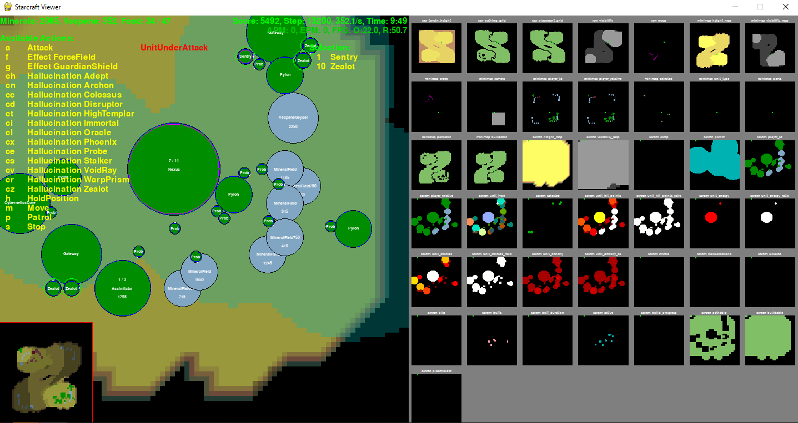

# Protoss SCII Agent

*This is a hand-in project on the Agent topic made by Fernando Vargas Álvarez*

On this folder you will find the agent file [protosAgent.py](protosAgent.py), which if run in the correct settings (with python, [pySC2](https://github.com/deepmind/pysc2) library and StarCraft 2 installed)

Run the following command to run the agent against a very easy agent bot:

    python protossAgent.py
## Context

PySC2 is a library made by DeepMind from Google company, it creates agents that interact  with StarCraft II game. Some classes ago, professor Benji shared an agent file that can play the basic dynamics of the game like build constructions, command attacks, and gather materials. 

## Agent rundown

This agent uses the Protoss race, which has a very similar functionality to its terran counter part in this same projects. But looking more into the documentation i could do some kind of upgrade:

- Build gateways to train Zealots and Sentries. Also order them to attack the enemy when there is at least 7 Zealots and one Sentry.
- Use Probes to build cibernetic cores, gateways, pylons and assimilator to train the army and gather vespene gas.

I

Get the full view of the agent's logic functioning on the [Agent Diagram](img/Diagrama2.pdf)

